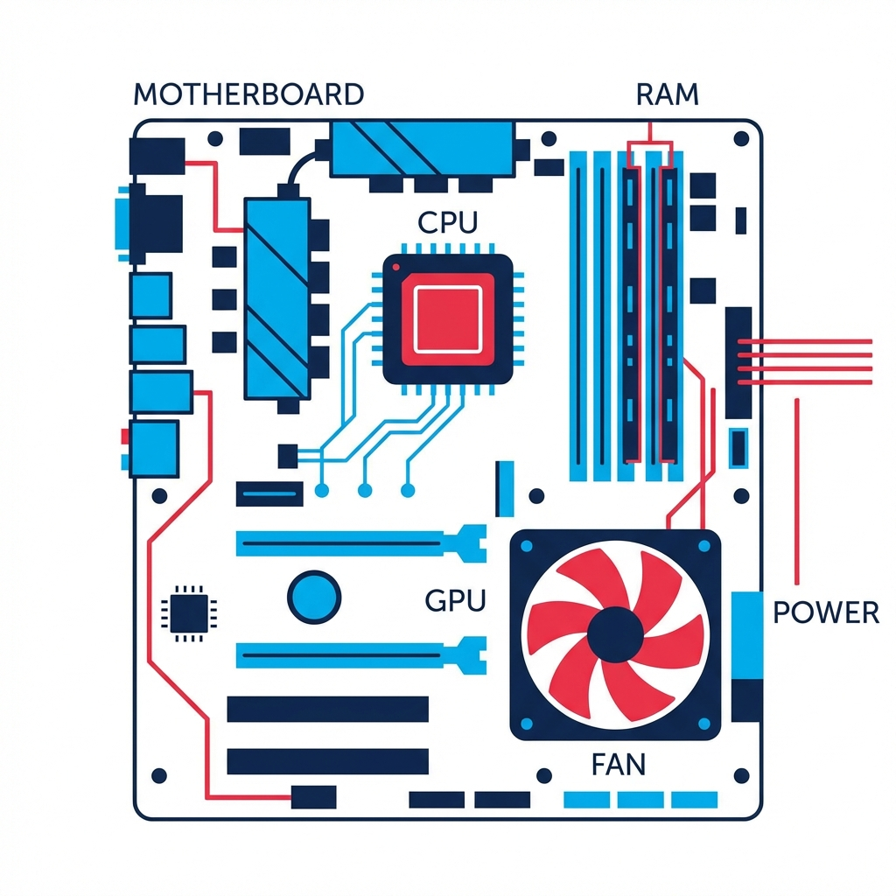

# 📘 رحلة بسيطة لفهم الآلة قبل البرمجة

**كتاب تفاعلي بالدارجة المغربية لشرح أساسيات علوم الحاسوب**

مرحباً بك في مشروع "رحلة بسيطة لفهم الآلة قبل البرمجة". هذا المشروع عبارة عن كتاب ويب تفاعلي (Interactive Web Book) يهدف لتبسيط المفاهيم المعقدة حول كيفية عمل الكمبيوتر، من الترانزيستور وحتى الذكاء الاصطناعي، بلغة بسيطة ومفهومة (الدارجة المغربية).



## 🎯 علاش هاد المشروع؟
بزاف ديال الناس كيدخلو لمجال البرمجة وكيبداو يحفضو الكود بلا ما يفهمو الآلة اللي كيكتبو ليها هاد الكود كيفاش كتخدم. الهدف ديال هاد الكتاب هو يبني ليك **أساس متين** يخليك تفهم:
- كيفاش الكهرباء كتحول لبيانات (Data).
- شنو الفرق بين الذاكرة والمعالج.
- كيفاش التصاور والصوت كيتحولو لـ 0 و 1.
- شنو هو الذكاء الاصطناعي فالحقيقة.

## ✨ المميزات
- **محتوى بالدارجة:** شرح سلس وبسيط بعيد على التعقيد الأكاديمي.
- **تفاعل مباشر:** جرب بنفسك كيفاش الترانزيستور كيخدم، وكيفاش الألوان كتحول لأرقام.
- **تصميم عصري:** واجهة مستخدم (UI) نقية مع دعم الوضع الليلي (Dark Mode).
- **متجاوب:** كيخدم مزيان فالتليفون و PC.
- **اختبارات:** كويز في الآخر باش تختبر الفهم ديالك.

## 🛠️ التقنيات المستعملة
هاد المشروع مبني بـ **Vanilla Web Technologies** باش يبقى خفيف وسريع:
- **HTML5:** للهيكلة والمحتوى.
- **CSS3:** للتصميم (CSS Grid, Flexbox, CSS Variables).
- **JavaScript (ES6):** للتفاعل واللوجيك.

## 🚀 كيفاش تخدم المشروع عندك؟
1. **Telecharger:** تيليشارجي الكود ولا دير ليه Clone:
   ```bash
   git clone https://github.com/YourUsername/machine-understanding-book.git
   ```
2. **Open:** فتح ملف `index.html` فأي متصفح (Browser).
3. **Enjoy:** بصحتك القراية!

## 📚 محتويات الكتاب
1. مقدمة
2. شنو هو الكمبيوتر فعلاً؟
3. كيفاش 0 و 1 ولات أرقام؟
4. كيفاش الحروف ولات 0 و 1؟
5. شنو هو المعالج (CPU)؟
6. الذاكرة (Memory).
7. الوسائط المتعددة (صور، صوت، فيديو).
8. البرنامج وكيفاش كيخدم.
9. حقيقة الذكاء الاصطناعي.

---
**تطوير:** أيوب بولخرسة (Ayoub BL)  
صنع بحب لتعميم المعرفة التقنية في المغرب 🇲🇦💻
